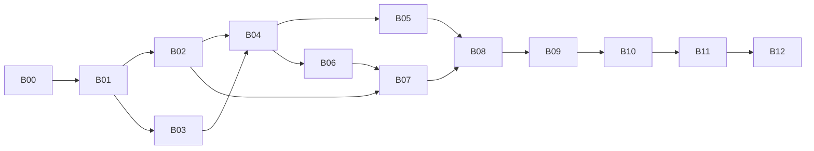

# Backlog do começo ao fim

13 fatias testáveis. Dependências liberam trabalho; não são aprovações formais. O estado fica somente em [PROGRESS.md](PROGRESS.md). Aplicar [testes](docs/TESTING.md) e [fechamento](docs/CLOSEOUT.md) a cada fatia. Criar packages/fontes conforme a necessidade, não todos os stubs de uma vez.

Grafo e consultas em memória aparecem antes de persistência. A ingestão usa catálogos de teste antes de filesystem. Nenhuma fatia precisa de cloud. [DAG verificável](spec/backlog_dag.json).

| Fatia | Resultado | Depende de |
|---|---|---|
| B00 | Módulo e primeiro teste real | — |
| B01 | Grafo consultável em memória | B00 |
| B02 | Consultas e composição em memória | B01 |
| B03 | Neptune CSV vira contribuições tipadas | B01 |
| B04 | Carga resiliente completa em memória | B02, B03 |
| B05 | Catálogos locais e diagnóstico real | B04 |
| B06 | Índices compactos | B04 |
| B07 | Snapshot byte a byte, ainda sem mmap | B02, B06 |
| B08 | mmap e publicação local segura | B05, B07 |
| B09 | CLI completa, DOT e consumidor de consulta | B08 |
| B10 | Robustez, fuzz e concorrência | B09 |
| B11 | Medições e custo observado | B10 |
| B12 | Fechamento do produto | B11 |

## B00 — Módulo e primeiro teste real

**Depende de:** nenhuma.

**Entrega:** módulo Go local, comando --help e harness reais. Usar a toolchain disponível; nome local `gophergraph`, sem remote inventado. Go module files normais, sem pins de spec.

**Área:** go.mod, cmd/gophergraph/main.go, teste smoke e primeiro package necessário.

**Gate:** `go test ./...`, `go vet ./...` e build `CGO_ENABLED=0` executados. Um teste intencionalmente falho deve devolver falha; removê-lo depois da prova. --help não abre dados. Nenhum stub apresentado como feature.

**Fechar:** B00 não exige engine, CSV ou x/sys. Registrar o build/teste realmente funcionando e avançar.

## B01 — Grafo consultável em memória

**Depende de:** B00.

**Entrega:** Graph imutável com IDs, labels, propriedades, CSR forward/reverse e sets. Helpers privados de fixtures constroem colunas heap sem snapshot/ingestão.

**Área:** graph e internal/graphdata. Usar slices/maps existentes, não implementar coleções genéricas próprias.

**Gate:** G01–G06: vazio, direção, self-loops, paralelas, multilabel, tags, bounds e identidade de sets. Iteradores reais, sem alocação por edge. Campos privados, nenhum import concreto de I/O. `go test ./graph/... ./internal/graphdata/...` e regressão existente.

**Fechar:** o grafo das próximas consultas já é real, não um mock que só retorna o esperado.

## B02 — Consultas e composição em memória

**Depende de:** B01.

**Entrega:** Reachable, Territory, AntiTerritory, Between e subgrafo completo, com filtros de labels e cancelamento.

**Área:** query; testes contra closure independente e fixtures de topologia.

**Gate:** Q01–Q08: diamante conserva quatro edges, paralelas não somem, reverse não inverte direção, origem/reflexividade, nil versus vazio, A=B e ciclos de Between. Cancelamento em hub grande. `go test ./query/...` e regressão.

**Fechar:** APIs permitem algoritmo personalizado por adjacência; nenhum parser/registry de consultas.

## B03 — Neptune CSV vira contribuições tipadas

**Depende de:** B01.

**Entrega:** adapter Neptune streaming com headers por papel, presença/quotedness, tipos, multiline, recuperação delimitada e limites. Stdlib usada sem perder semântica.

**Área:** ingest/ports e ingest/adapters/neptune (reader, framing, header, values).

**Gate:** C01–C11: blank diferente de quoted empty; CRLF interno preservado; todas as tags; fonte errada rejeitada; UTF-8 inválido isolado; aspas até EOF encerram só fonte. Records maiores que 64 KiB, limites e fragmentação. `go test ./ingest/adapters/neptune/...`. Introduzir seeds de FuzzNeptuneCSV que o teste normal já executa.

**Fechar:** não marcar compatível porque encoding/csv leu um CSV feliz. Contratos de ausência/arrays/tipagem precisam de provas.

## B04 — Carga resiliente completa em memória

**Depende de:** B02, B03.

**Entrega:** Build recebe dois catálogos de memória, carrega todos os nodes antes de edges, faz staging/merge/canonicalização/CSR e retorna Graph + Report.

**Área:** ingest/{build,model,merge,canonicalize,csr,report}; nenhum filesystem nesta fatia.

**Gate:** I01–I12 e todos os modelos de fixtures: header ruim, endpoint ausente, conflitos/quarentena e empty/all-rejected não derrubam lote. Fonte I/O ruim é isolada; catálogo/sink/cancelamento são operacionais. Permutações e diagnósticos/counters conferidos. `go test ./ingest/...` e regressão de graph/query.

**Fechar:** dados ruins produzem snapshot futuro parcial coerente, não falha global. Não confundir registros staged com entidades finais.

## B05 — Catálogos locais e diagnóstico real

**Depende de:** B04.

**Entrega:** adapters filesystem e stderr substituem os de teste; dois diretórios explícitos. Fechar cada fonte antes de abrir a próxima.

**Área:** ingest/adapters/filesystem e stderr; testes de integração local.

**Gate:** catálogos vazios, arquivo sem extensão, arquivo errado, diretório/symlink, entrada sem permissão quando simulável, falha no reader, logs escapados. Resultado igual ao catálogo em memória; inputs não são alterados. `go test ./ingest/...` e testes locais com t.TempDir.

**Fechar:** não implementar S3 para provar a interface; a troca memória -> filesystem já fornece evidência.

## B06 — Índices compactos

**Depende de:** B04.

**Entrega:** postings obrigatórios de labels/IDs e opcionais de propriedades de nodes/edges. Lista de chaves indexadas preservada inclusive sem valores.

**Área:** ingest/index, graph/index, colunas compartilhadas privadas.

**Gate:** X01–X02 e G04–G05: index/scan equivalentes, valores set/NaN/zeros/tags distintos, chaves ausentes, índice vazio, memberships exatos. `go test ./graph/... ./ingest/...`.

**Fechar:** nenhuma tabela bitmap por valor de alta cardinalidade nem planner. Scan continua sendo comportamento definido.

## B07 — Snapshot byte a byte, ainda sem mmap

**Depende de:** B02, B06.

**Entrega:** codec completo de 24 seções, writer sequencial e reader/validador sobre source/sink de memória. Magic GOPHGRPH e format_version=1 apenas técnico.

**Área:** snapshot, snapshot/ports, acesso LE privado às colunas. Não copiar layout de struct Go; não usar gob/unsafe.

**Gate:** S01–S07: goldens exatos, reader independente, todos os dados e consultas preservados, overflow/offset/payload/postings inválidos rejeitados antes de acesso. Seeds de FuzzSnapshotDecode. `go test ./snapshot/...` e regressão. Comparar writer do produto com goldens não gerados pelo produto.

**Fechar:** byte view de memória já exercita o mesmo acesso que mmap usará. Não adiar layout/validação para a próxima fatia.

## B08 — mmap e publicação local segura

**Depende de:** B05, B07.

**Entrega:** Source mmap com x/sys/unix; Sink local com tempfile, Seal, validação, sync, rename e sync do diretório. Owner de Graph fecha mapping explicitamente.

**Área:** snapshot/adapters/mmap e file; integração com catálogos reais.

**Gate:** S06–S11: mesmo Graph heap/bytes/mmap, recursos fechados uma vez, leitor antigo após publicação nova, falha antes/depois de rename, short writes e cleanup. `CGO_ENABLED=0 go test ./snapshot/...` e build do produto. Dependência só no adapter.

**Fechar:** nenhum fallback silencioso de mmap para cópia inteira. Falha de durabilidade pós-rename é PublishedUncertain, não falso rollback.

## B09 — CLI completa, DOT e consumidor de consulta

**Depende de:** B08.

**Entrega:** build/territory/anti-territory/between utilizáveis, CSV de IDs e DOT; exemplo shared_targets em consumidor separado da implementação.

**Área:** cmd/gophergraph, dot, examples/shared_targets e tests/e2e.

**Gate:** E01–E06: dois diretórios reais até consulta em subprocesso, flags/exit codes, empty ID quoted, multiline, partial em stderr e dados limpos stdout, DOT não-strict e escaping. Exemplo importa apenas API pública sem editar core/registry. `go test ./...`, build e execução E2E reais.

**Fechar:** CLI só compõe, não contém BFS/merge/codec. Graphviz externo é validação extra quando disponível.

## B10 — Robustez, fuzz e concorrência

**Depende de:** B09.

**Entrega:** casos adversariais, campanhas de fuzz, erros dos ports, cancelamento e leitura concorrente qualificados.

**Área:** testes das capacidades; correções locais necessárias, sem framework novo.

**Gate:** R01–R05, `CGO_ENABLED=1 go test -race ./...`, vet, regressão completa e as duas campanhas de fuzz de TESTING. Sem panic por arquivo malformado, sem estado global de workspace, sem crescimento de descritores/mappings. Não tentar recuperar OOM fatal nem suportar Close concorrente fora do contrato.

**Fechar:** evidência de race é sobre testes rodados; Go não tornou mmap magicamente seguro. Bugs viram casos mínimos de regressão.

## B11 — Medições e custo observado

**Depende de:** B10.

**Entrega:** benchmarks corretos em escalas crescentes, com fases/allocs/RSS e tamanho do snapshot separados.

**Área:** benchmarks nativos Go e nota curta de resultados.

**Gate:** P01–P03: fórmula bate com bytes; cada node é expandido no máximo uma vez; diamantes não enumeram caminhos; hot loop não aloca por edge. `go test -run '^$' -bench . -benchmem ./...` e regressão após otimizações. Medir abertura/validação separada de query sobre Graph aberto.

**Fechar:** não inventar SLA nem anunciar vantagem sobre outra linguagem sem comparação. Unsafe/pools/cloud não são exigências para fechar.

## B12 — Fechamento do produto

**Depende de:** B11.

**Entrega:** outra sessão constrói, testa e usa o repositório sem a conversa nem arquivos antigos.

**Área:** README com uso efetivo, PROGRESS final, limpeza de stubs/código morto e ajustes de docs.

**Gate:** protocolo final de CLOSEOUT; testes sem cache, vet/gofmt, build sem cgo, race, fuzz, E2E completo e parcial, goldens, consumidor externo e benchmarks. Todos os gates obrigatórios anteriores realmente concluídos.

**Fechar:** marcar produto concluído em PROGRESS. Não publicar remote/cloud nem iniciar novas features. HTTP, S3 e novas consultas não são pendências desta entrega.
